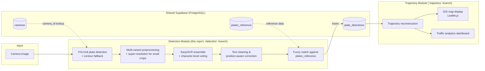

# VecTag

**City-Wide AI Engine for Multi-Camera ANPR Trajectory Tracking and Urban Traffic Analytics**

Built for **Smart India Hackathon 2026**, problem statement **SIH26127** (sponsor: Bharat Electronics Limited).

VecTag reads vehicle license plates from (simulated) city camera feeds, matches them against a known-vehicles database, and reconstructs a single vehicle's movement across multiple cameras over time — surfaced on a live map with basic traffic analytics.

---

## How it works

The system is split into two independently-developed modules that only communicate through a shared Supabase database and a fixed API contract — neither module reads or writes the other's tables directly.

---

## Modules

### 🔍 Detection & Matching (`detection` branch)

Single end-to-end endpoint: `POST /scan`. Given a camera image, it detects the plate, reads it, cleans it up, and matches it against known vehicles.

| Stage | Approach |
|---|---|
| Plate detection | Custom-trained YOLOv8 model, with an OpenCV contour-based fallback for low-confidence boxes |
| Preprocessing | 9 threshold/contrast/morphology variants per crop, plus an FSRCNN super-resolution pass for small/low-res crops |
| Text recognition | EasyOCR across every variant, combined with cross-variant character-level voting |
| Text cleaning | Position-aware letter/digit correction, validated against real Indian state/RTO codes |
| Matching | Fuzzy string matching (RapidFuzz) against `plates_reference`, with edit-distance and length guardrails to avoid false-positive matches |

### 🗺️ Trajectory & Analytics (`trajectory` branch)

Owned and built independently by a teammate. Covers:
- Camera location management
- Reconstructing a vehicle's path across multiple camera detections over time
- GIS map visualization (Leaflet.js)
- Traffic analytics dashboard

*(Implementation details are out of scope for this README's detection-side author — see the `trajectory` branch directly for specifics.)*

---

## Tech Stack

| Layer | Technology |
|---|---|
| Backend | Python, FastAPI |
| Database | Supabase (hosted PostgreSQL) — shared instance |
| Frontend | Plain HTML/CSS/JS, Leaflet.js |
| Detection | Ultralytics YOLOv8 |
| OCR | EasyOCR |
| Fuzzy matching | RapidFuzz |
| Image processing | OpenCV (`opencv-contrib-python`, incl. `dnn_superres`) |
| ML runtime | PyTorch (CUDA-accelerated where available) |

Everything in the stack is free / open-source — no paid APIs or licensed models.

---

## Project Status

Prototype under active development for SIH 2026.

---

## Team

A 2-person student team built this for SIH 2026, splitting detection/matching and trajectory/analytics as independent, API-contracted modules against a shared database.
